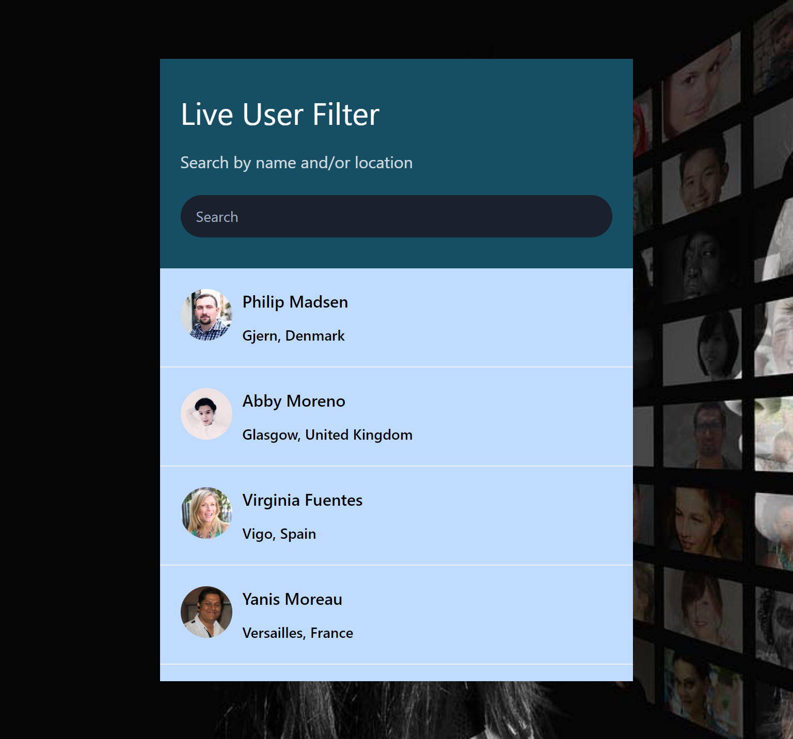

# Live User Filter



This project is an assignment where I used an open API to fetch live user data, manipulated the data with JavaScript, and presented the data via an HTML page.

You can view the live project here: [Live User Filter](https://yosephdev.github.io/live-user-filter/)

## Table of Contents

- [Project Overview](#project-overview)
- [Usage](#usage)
- [Features](#features)
- [Technologies Used](#technologies-used)
- [How to Run Locally](#how-to-run-locally)

## Project Overview

The Live User Filter project fetches data from an open API containing information about live users. It then allows users to filter and manipulate this data in real-time using JavaScript. The filtered results are presented on an HTML page.

## Usage

1. Visit the live project [here](https://yosephdev.github.io/live-user-filter/).
2. You will see a list of live users.
3. Use the filter options provided to filter the users based on different criteria such as gender, nationality, etc.
4. The list of users will update in real-time as you apply filters.

## Features

- Real-time filtering of live user data.
- User-friendly interface for applying filters.
- Display of user information including name, picture, gender, nationality, and age.
- Responsive design for various screen sizes.

## Technologies Used

- HTML
- CSS
- JavaScript
- Open API (used to fetch user data)

## How to Run Locally

If you want to run this project locally on your machine, follow these steps:

1. Clone this repository to your local machine using:

   ```bash
   git clone https://github.com/yosephdev/live-user-filter.git

   # Navigate to the project directory
   cd live-user-filter

3. Open the index.html file in your web browser

   That's it! You can now use the Live User Filter application locally on your machine.


